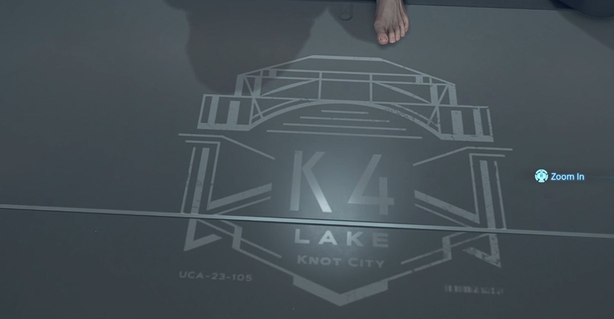

# Lake Knot City - Private Room

## Floor marking

The floor of the private room in Lake Knot City displays a bridge emblem, the large marking **K4**, and **LAKE KNOT CITY**.

The ID printed beneath the emblem is **UCA-23-105**.

## Screenshot

## Source

Observed in `DeathStranding_ 003.jpg` (Lake Knot City private-room floor screenshot). Location and ID also identified by the player. A copy of the screenshot is stored in the vault.

## Related notes

- [[capital_knot_city_private_room|Capital Knot City - Private Room]] — Another private-room floor marking for comparison.
- [[lake_knot_city_an_ocean_beyond_the_private_room_door|Lake Knot City - An Ocean Beyond the Private Room Door]] — A personal recollection of a cutscene in this location.

## Tasks

![[to_do_list#^listen-pop-virus]]

[[to_do_list#^listen-pop-virus|Open this task in the TODO list]]

#locations

