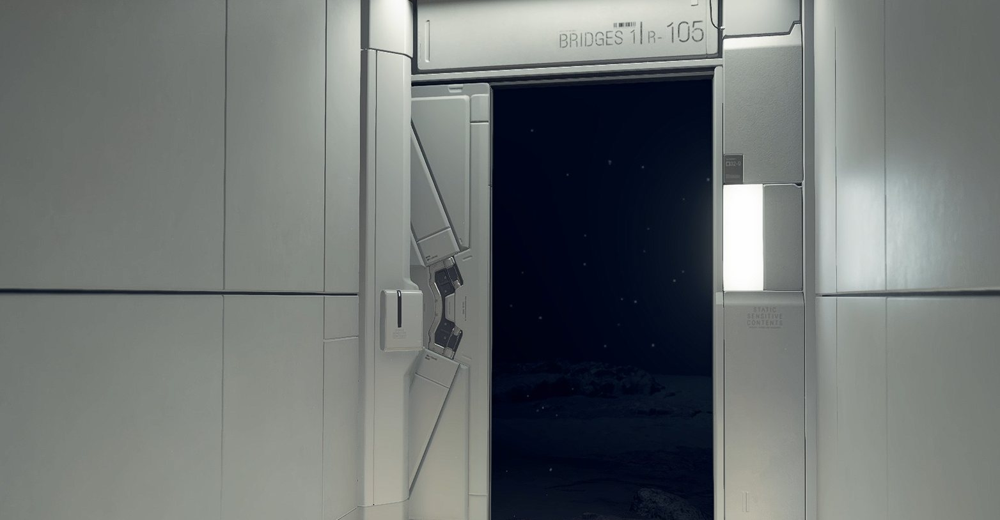

#personal-log

# Lake Knot City - An Ocean Beyond the Private Room Door

## My recollection

While I was resting in the private room in Lake Knot City, a cutscene played. Suddenly the door opened, and I saw an ocean with a monster in it.

I'm not sure what to make of this scene. I'm recording it here so I can remember it and return to it if something later helps explain it.

## Screenshot

The screenshot captures the open doorway and the dark view beyond it. The ocean and monster are part of my recollection of the cutscene; the monster is not clearly identifiable in this still image.

## Source

Player recollection and the supplied screenshot, originally named `DeathStranding_ 008.jpg`. A separate copy is stored in the vault with a descriptive filename. The scene's meaning has not been established.
